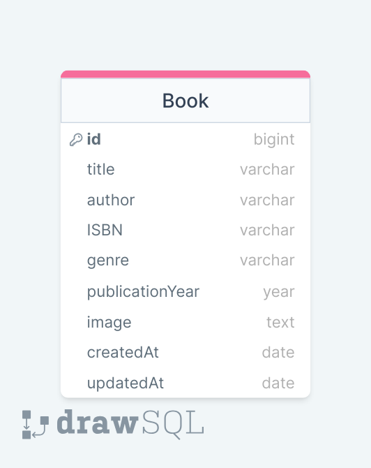

<p>Clarusway</p>

# BE-ASS-01 : Basic Library Management System with CRUD Operations for Books

## Description

In this project, you will create a basic Library Management System using Express.js as the backend framework and Sequelize as the ORM for database interaction. The focus of this project is to implement CRUD (Create, Read, Update, Delete) operations for books. The application should allow users to add, view, update, and delete book records in the library.

## Project Skeleton

Your project directory structure might look like this:

```
library-management-system/
  ├── app.js          // Express.js server setup
  ├── db.js          // db connection setup
  ├── models/
  |     └── book.js  // Sequelize Book model
  ├── routes/
  |     └── books.js // Express.js routes for book CRUD operations
  ├── package.json    // Node.js project configuration
  └── README.md       // Project documentation
```

## Project ERD



## Project Tasks

1. **Database Setup:**
   - Set up a database using Sequelize to store book information.
   - Define a Book model with attributes such as title,image, author, ISBN, genre, and publicationYear.
2. **CRUD Operations:**
   - Implement the following CRUD operations for books:
     - Create: Users should be able to add new book records to the database.
     - Read: Users should be able to view a list of all books in the library.
     - Update: Users should be able to edit book information.
     - Delete: Users should be able to remove book records from the library.
3. **API Endpoints:**
   - Create RESTful API endpoints for performing CRUD operations on books (e.g., `/books` for listing all books, `/books/:id` for specific book operations).
4. **Validation and Error Handling:**
   - Implement input validation to ensure that users provide necessary book details.
   - Handle errors and provide meaningful error messages.
5. **User Interface (Optional):**
   - You can create a simple web interface for users to interact with the system using React or HTML-CSS and JavaScript.
   - Implement forms for adding, updating, and deleting books.
   - **You can explore the ['cors'](https://www.npmjs.com/package/cors) package to do this.**
6. **Documentation:**
   - Provide clear and well-documented code.
   - Include a README file that explains how to set up and run the project locally.

## **Additional Guidelines:**

- Use Express.js for creating the server and routing.
- Use Sequelize as your ORM for interacting with the database.
- Use a relational database (e.g., PostgreSQL, MySQL) to store book data.
- Follow best practices for code organization and file structure.
- Test your CRUD operations to ensure they work correctly.

## **Deliverables:**

- A GitHub repository containing your project.
- A live demonstration of your project (if possible).

## Example User Interface
- https://booklist-front.vercel.app/

## Notes

- You can add additional functionalities to your app.

**<p align="center">&#9786; Happy Coding &#9997;</p>**
