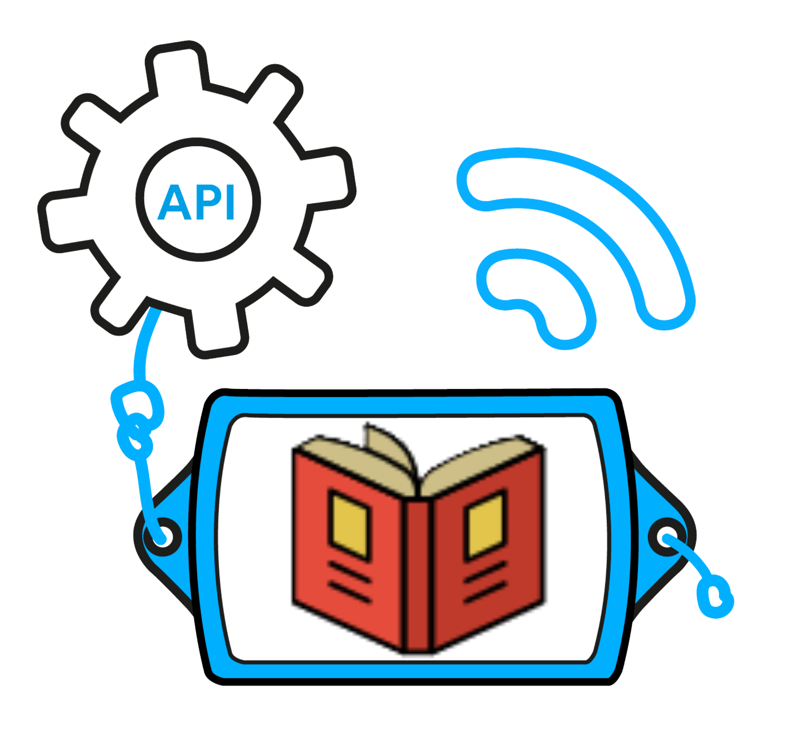

<a name="readme-top"></a>

<!-- PROJECT SHIELDS -->
<!--
*** I'm using markdown "reference style" links for readability.
*** Reference links are enclosed in brackets [ ] instead of parentheses ( ).
*** See the bottom of this document for the declaration of the reference variables
*** for contributors-url, forks-url, etc. This is an optional, concise syntax you may use.
*** https://www.markdownguide.org/basic-syntax/#reference-style-links
-->

<div align="center">

[![Forks][forks-shield]][forks-url]
[![Stargazers][stars-shield]][stars-url]
[![Issues][issues-shield]][issues-url]
[![MIT License][license-shield]][license-url]
[![LinkedIn][linkedin-shield]][linkedin-url]

</div>

[contributors-shield]: https://img.shields.io/github/contributors/omrfrkcpr/novelit_api.svg?style=flat-square&color=blue
[contributors-url]: https://github.com/omrfrkcpr/novelit_api/graphs/contributors
[forks-shield]: https://img.shields.io/github/forks/omrfrkcpr/novelit_api.svg?style=flat-square&color=blueviolet
[forks-url]: https://github.com/omrfrkcpr/novelit_api/network/members
[stars-shield]: https://img.shields.io/github/stars/omrfrkcpr/novelit_api.svg?style=flat-square&color=brightgreen
[stars-url]: https://github.com/omrfrkcpr/novelit_api/stargazers
[issues-shield]: https://img.shields.io/github/issues/omrfrkcpr/novelit_api.svg?style=flat-square&color=red
[issues-url]: https://github.com/omrfrkcpr/novelit_api/issues
[license-shield]: https://img.shields.io/github/license/omrfrkcpr/novelit_api.svg?style=flat-square&color=yellow
[license-url]: https://github.com/omrfrkcpr/novelit_api/blob/main/LICENSE
[linkedin-shield]: https://img.shields.io/badge/-LinkedIn-black.svg?style=flat-square&logo=linkedin&color=blue
[linkedin-url]: https://linkedin.com/in/omrfrkcpr

<!-- PROJECT LOGO -->
<br />
<div align="center">
  <a href="https://github.com/omrfrkcpr/novelit_api">
    
  </a>

<h3 align="center">Novelit_API</h3>

  <p align="center">
    The Novelit API is a powerful and efficient RESTful service designed to manage book information within a database. Built with Node.js, Express.js, SQLite, and Sequelize, the API supports full CRUD operations, enabling users to create, read, update, and delete book records. The API follows the MVC (Model-View-Controller) architecture to ensure a clean separation of concerns, making the codebase more manageable and scalable.
    <br />
    <a href="https://github.com/omrfrkcpr/novelit_api"><strong>Explore the docs »</strong></a>
    <br />
    <a href="https://github.com/omrfrkcpr/novelit"><strong>Novelit App»</strong></a>
    <br />
    <br />
    <a href="https://novelit-server.onrender.com/books">View API</a>
    ·
    <a href="https://github.com/omrfrkcpr/novelit_api/issues/new?labels=bug&template=bug-report---.md">Report Bug</a>
    ·
    <a href="https://github.com/omrfrkcpr/novelit_api/issues/new?labels=enhancement&template=feature-request---.md">Request Feature</a>
  </p>
</div>

<!-- TABLE OF CONTENTS -->
<details>
  <summary>Table of Contents</summary>
  <ol>
    <li>
      <a href="#about-the-project">About The Project</a>
      <ul>
        <li><a href="#built-with">Built With</a></li>
      </ul>
    </li>
    <li><a href="#structure">Structure</a></li>
    <li><a href="#features">Features</a></li>
    <li><a href="#components">Components</a></li>
    <li><a href="#technical">Technical</a></li>
    <li><a href="#contributing">Contributing</a></li>
    <li><a href="#license">License</a></li>
    <li><a href="#contact">Contact</a></li>
    <li><a href="#acknowledgments">Acknowledgments</a></li>
  </ol>
</details>

<!-- ABOUT THE PROJECT -->

## About The Project

[Postman-Documentation](https://documenter.getpostman.com/view/14573422/2sA3drKFJ7)

<p align="right">(<a href="#readme-top">back to top</a>)</p>

### Built With

<p align="center">
  <a href="https://skillicons.dev">
    
  </a>
</p>

<p align="right">(<a href="#readme-top">back to top</a>)</p>

<!-- STRUCTURE -->

## Structure

```
novelit_api
  ├── src/
  |     ├── config
  |     |     └── db.js
  |     ├── controllers
  |     |     └── bookController.js
  |     ├── middlewares
  |     |        ├── errorHandler.js
  |     |        ├── validateBook.js
  |     |        └── validateIdHandler.js
  |     ├── models
  |     |     └── bookModel.js
  |     ├── routers
  |     |     └── bookRouter.js
  ├── .gitignore
  ├── bookdb.sqlite3
  ├── erd.png
  ├── LICENSE
  ├── novelit_api.png
  ├── package-lock.json
  ├── package.json
  ├── README.md    // Project documentation
  ├── sample.env
  └── server.js
```

See the [open issues](https://github.com/omrfrkcpr/novelit_api/issues) for a full list of proposed features (and known issues).

<p align="right">(<a href="#readme-top">back to top</a>)</p>

<!-- FEATURES -->

## Features

CRUD Operations:

- Create: Add new books with detailed information such as title, author, genre, publication date, and summary.
- Read: Retrieve information about books, either all at once or individually by ID.
- Update: Modify the details of existing books.
- Delete: Remove books from the collection.

MVC Architecture:

- Model: Defines the structure of the book data and interacts with the SQLite database using Sequelize ORM.
- View: Though typically associated with frontend, in this context, it refers to the response sent back to the client.
- Controller: Handles incoming requests, processes data using models, and returns the appropriate responses.

Database Management:

- Utilizes SQLite for lightweight, server-side storage.
- Sequelize ORM provides an easy-to-use interface for database operations, enabling complex queries and relationships.

Routing:

- Express.js handles routing, directing API requests to the appropriate controllers.
- Organized routes for handling book-related operations.

Error Handling:

- Robust error handling to manage invalid inputs, missing data, and other potential issues.
- Custom error messages to guide users and developers.

Middleware:

- Utilizes Express middleware for parsing request bodies, handling JSON data, and managing static files.

Tools and Technologies:

- Postman is used for API testing, ensuring that all endpoints are functioning correctly and efficiently.
  The application is hosted on Render, a reliable hosting service that ensures high availability and performance.

Deployment:

- The project is deployed on Render, allowing for easy access and scalability. Render's platform provides automatic builds and deployments, making the development process smoother.

<p align="right">(<a href="#readme-top">back to top</a>)</p>

<!-- COMPONENTS -->

## Components

Models:

- Defined using Sequelize to represent the book data structure.
- Models include fields for book details such as title, author, genre, publication date, and summary.
- Associations and validations ensure data integrity and consistency.

Controllers:

- Contain the logic for handling CRUD operations.
- Interact with Sequelize models to perform database operations.
- Return JSON responses to the client, containing data or error messages as appropriate.

Routes:

- Defined in Express to handle API endpoints.
- Routes map to controller actions for creating, reading, updating, and deleting books.

Example endpoints:

- POST /books - Create a new book.
- GET /books - Retrieve all books.
- GET /books/:id - Retrieve a specific book by ID.
- PUT /books/:id - Update a book by ID.
- DELETE /books/:id - Delete a book by ID.

Middleware:

- Used to parse incoming request bodies (e.g., express.json()).
- Additional middleware can be added for authentication, logging, etc.

<p align="right">(<a href="#readme-top">back to top</a>)</p>

<!-- TECHNICAL -->

## Technical

Frontend:

- React: A JavaScript library for building user interfaces.
- TypeScript: A statically typed superset of JavaScript.
- TailwindCSS: A utility-first CSS framework for rapid UI development.
- ContextAPI: For managing state across the application.

Backend:

- Node.js: A JavaScript runtime built on Chrome's V8 engine.
- Express.js: A minimal and flexible Node.js web application framework.
- SQLite: A lightweight, disk-based database that doesn’t require a separate server process. Ideal for small to medium-sized applications.
- Sequelize: A promise-based Node.js ORM for SQLite, providing a straightforward API for interacting with the database and managing data models.

Tools:

- Postman: An API client for testing and developing APIs.
- Render: A cloud platform for hosting web applications.

<p align="right">(<a href="#readme-top">back to top</a>)</p>

<!-- CONTRIBUTING -->

## Contributing

Contributions are what make the open source community such an amazing place to learn, inspire, and create. Any contributions you make are **greatly appreciated**.

If you have a suggestion that would make this better, please fork the repo and create a pull request. You can also simply open an issue with the tag "enhancement".
Don't forget to give the project a star! Thanks again!

1. Fork the Project
2. Create your Feature Branch (`git checkout -b feature/AmazingFeature`)
3. Commit your Changes (`git commit -m 'Add some AmazingFeature'`)
4. Push to the Branch (`git push origin feature/AmazingFeature`)
5. Open a Pull Request

<p align="right">(<a href="#readme-top">back to top</a>)</p>

<!-- LICENSE -->

## License

Distributed under the MIT License. See [LICENSE.txt](https://github.com/omrfrkcpr/novelit_api/blob/main/LICENSE) for more information.

<p align="right">(<a href="#readme-top">back to top</a>)</p>

<!-- CONTACT -->

## Contact

[Support](omerrfarukcapur@gmail.com)<br />
[Repo Link](https://github.com/omrfrkcpr/novelit_api)<br />
[API](https://novelit-server.onrender.com/books)

<p align="right">(<a href="#readme-top">back to top</a>)</p>

<!-- ACKNOWLEDGMENTS -->

## Acknowledgments

- [novelit-app](https://novelit.vercel.app/)
- [novelit-app-repo](https://github.com/omrfrkcpr/novelit)
- [postman-doc](https://documenter.getpostman.com/view/14573422/2sA3drKFJ7)

<p align="right">(<a href="#readme-top">back to top</a>)</p>
